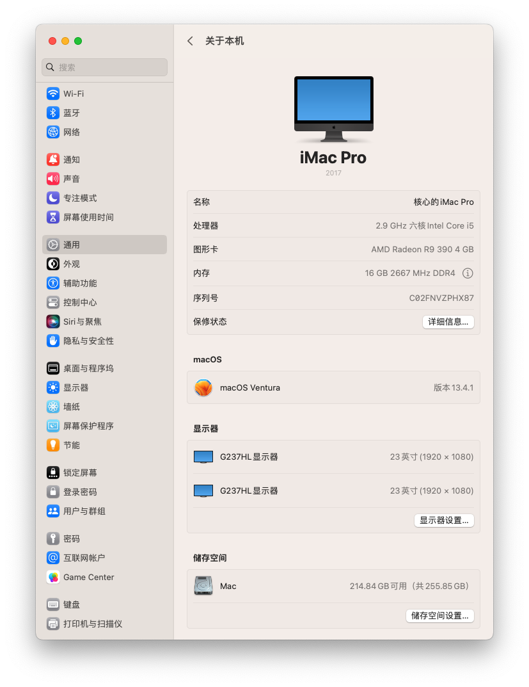
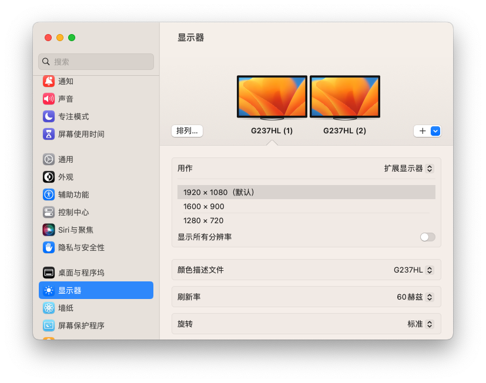
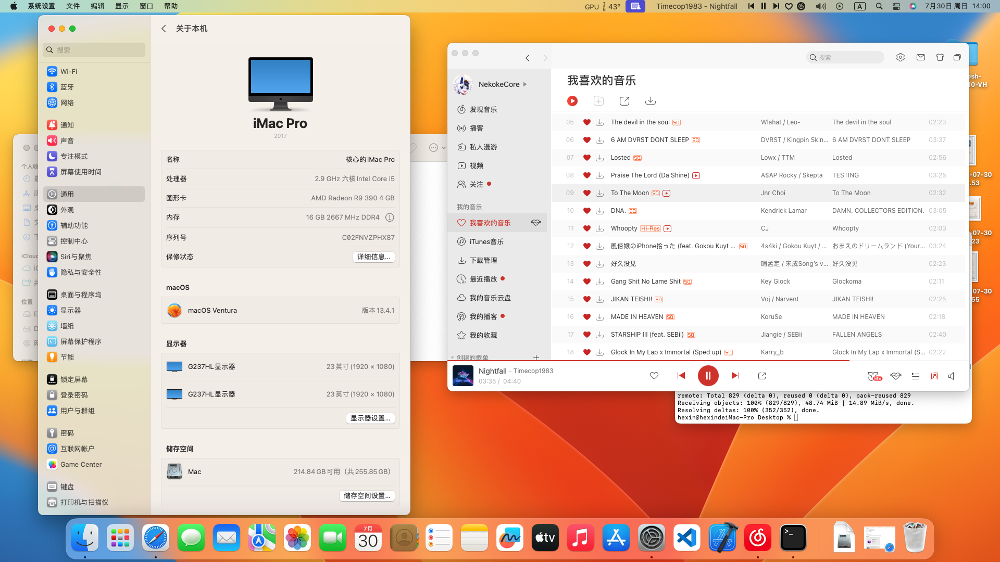
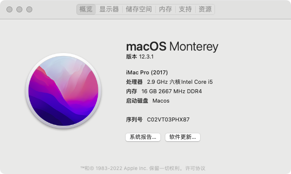
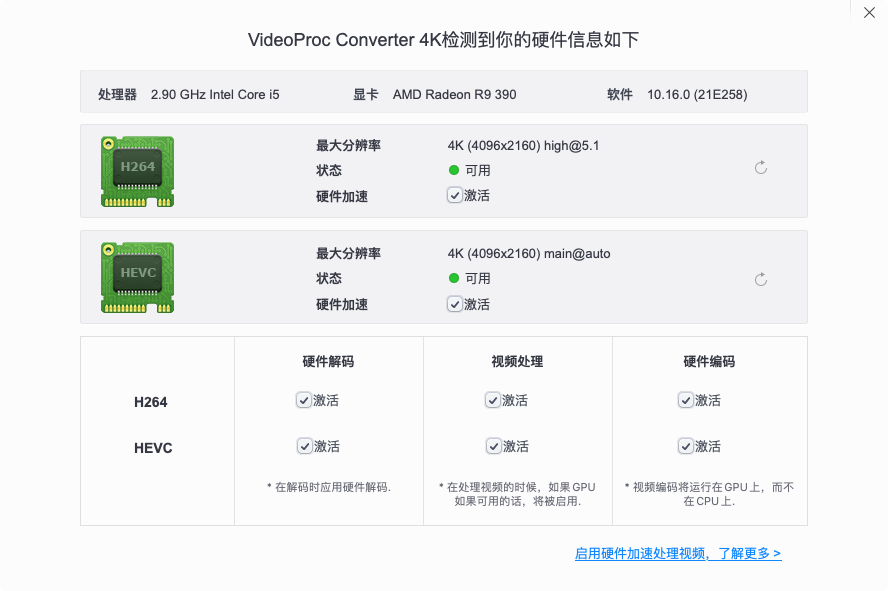

# Hackintosh-ONDA-H510-VH
Hackintosh for Intel ONDA-H510-VH with i5-10400F and Radeon RX550(Lexa) Hardware acceleration work！

## Hardware
|  Hardware   | Name  |
|  ----  | ----  |
| CPU  | Intel i5-10400F |
| RAM  | Samsung 16GB DDR4 2888MHZ |
| GPU  | AMD Radeon RX550(Lexa) 4GB |
| Ethernet  | Realtek GEB 8168/8111/8112 Family Network|
| Audio | Realtek ALC897 |

## Update Log
### 2022.5.9
1. Init.
2. Can boot Macos Monterey.
3. OpenCore boot up with display garbled code but not effect for uses.
4. Hinernate not work.

### 2023.7.30 
1. Update to OC 9.3.0
2. Fix OpenCore boot up display garbled code.
3. Add Boot bark audio.
4. Support Double screen.
5. Hinernate support not completely now.

## Bugs
1. You tell me.

## Screenshot
### Ventura

### Monterey

